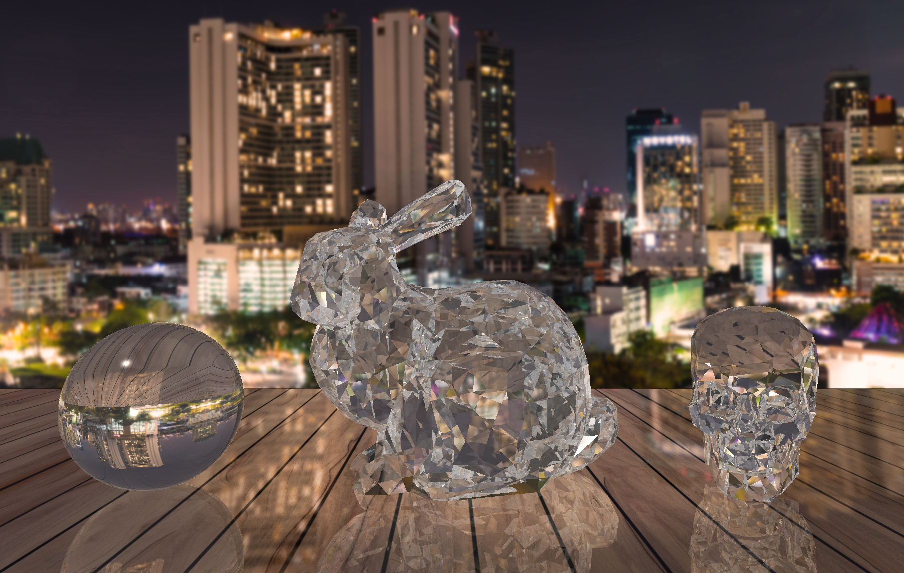

## Brief Summary of work:

1. Developed a ray tracing algorithm to generate 3D images based on a JSON file defining the scene, outputred rendered image as a ppm file. Rendering techniques such as Blinn-Phong shading, shadows, reflections, transparency, and refraction were used. (`raycolor.cpp`, `blinn_phong_shading.cpp`)

2. Transparency and refraction (`raycolor.cpp`)
	* Used Snell's law to calculate transmitted and reflected rays
	* Schlick approximation used to caluclate reflectivity
	* Support for coloured glass using Beer's Law. Constants in lines 122-124 may be modified to get coloured/tinted glass effects
		
3. Prevent dark shadowing for transparent objects  (`blinn_phong_shading.cpp`) 
	* An albedo term determines the reflectance of a material and allows light to pass through object. (blinn_phong_shading.cpp)

4. Multithreading support for raytracing (`main.cpp`)
	* Implemented using OpenMP library
	* Roughly a 3 times speedup achieved
	
5. Added features to scale, rotate, and translate stl objects. (`read_jason.h`)

## Instruction to run ray tracer

### Instructions for compiling:
	OpenMP must be installed
	OpenMP is extremely difficult to use with cmake on MacOS

The following cmake command worked for me on macOS Catalina:
Source: https://github.com/oneapi-src/oneDNN/issues/591

Please update paths to match yours.

> `cmake .. -DOpenMP_CXX_FLAGS="-Xclang -fopenmp -I/usr/local/opt/libomp/include/" -DOpenMP_C_FLAGS="-Xclang -fopenmp -I/usr/local/opt/libomp/include/" -DOpenMP_CXX_LIB_NAMES=libomp -DOpenMP_C_LIB_NAMES=libomp -DOpenMP_libomp_LIBRARY=/usr/local/lib/libomp.dylib -DCMAKE_SHARED_LINKER_FLAGS="-L/usr/local/lib/ -lomp -Wl,-rpath,/Users/Ushruff/.homebrew/opt/libomp/lib" -DCMAKE_BUILD_TYPE=Release`

### Run Command:
> `./raytracing ../data/final_image.json`

**Note:** It takes ~20 min to run at a depth of 10 on my very slow computer, ~8.5 min at a depth of 6.

## Rendered Image

